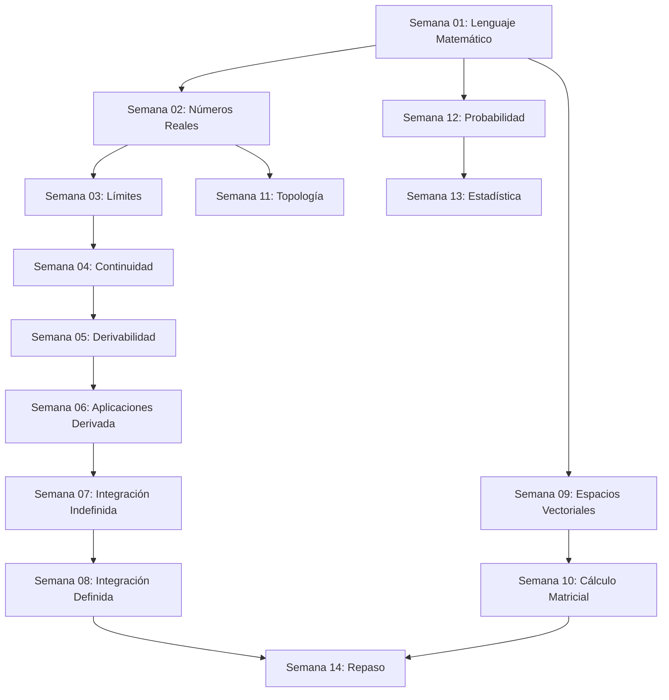

# Matemáticas I - Análisis y Álgebra Básica

## 📚 Descripción del Curso

Este curso cubre los fundamentos del análisis matemático y álgebra lineal básica, correspondiente al primer año del Grado en Matemáticas de la USC. Se enfoca en desarrollar el rigor matemático y las herramientas fundamentales para cursos avanzados.

**Duración**: 14 semanas  
**Nivel**: Primer año universitario  
**Prerrequisitos**: Matemáticas de Bachillerato

---

## 🗓️ Mapa Semanal → Temas → Objetivos

| Semana | Tema | Objetivos Principales | Tiempo Est. |
|--------|------|----------------------|-------------|
| **01** | [Lenguaje Matemático y Conjuntos](Semana_01_Lenguaje_Matematico_Conjuntos/) | Dominar notación matemática, operaciones con conjuntos, lógica proposicional | 9h |
| **02** | [Números Reales y Propiedades](Semana_02_Numeros_Reales_Propiedades/) | Comprender la estructura de ℝ, axiomas, propiedades algebraicas | 8h |
| **03** | [Introducción al Análisis - Límites](Semana_03_Introduccion_Analisis_Limites/) | Definir límites, calcular límites básicos, teoremas fundamentales | 10h |
| **04** | [Continuidad de Funciones](Semana_04_Continuidad_Funciones/) | Definir continuidad, clasificar discontinuidades, teoremas de continuidad | 9h |
| **05** | [Derivabilidad - Conceptos](Semana_05_Derivabilidad_Conceptos/) | Definir derivada, reglas de derivación, interpretación geométrica | 10h |
| **06** | [Aplicaciones de la Derivada](Semana_06_Aplicaciones_Derivada/) | Optimización, teoremas del valor medio, análisis de funciones | 11h |
| **07** | [Integración Indefinida](Semana_07_Integracion_Indefinida/) | Antiderivadas, técnicas básicas de integración, primitivas | 10h |
| **08** | [Integración Definida](Semana_08_Integracion_Definida/) | Integral de Riemann, teorema fundamental del cálculo, aplicaciones | 12h |
| **09** | [Espacios Vectoriales](Semana_09_Espacios_Vectoriales/) | Definir espacios vectoriales, subespacios, dependencia lineal | 9h |
| **10** | [Cálculo Matricial](Semana_10_Calculo_Matricial/) | Operaciones matriciales, determinantes, sistemas lineales | 10h |
| **11** | [Topología Euclidiana](Semana_11_Topologia_Euclidiana/) | Métricas, conjuntos abiertos/cerrados, compacidad básica | 8h |
| **12** | [Probabilidad Básica](Semana_12_Probabilidad_Basica/) | Espacios de probabilidad, variables aleatorias discretas | 7h |
| **13** | [Estadística Descriptiva](Semana_13_Estadistica_Descriptiva/) | Medidas de tendencia central, dispersión, distribuciones | 6h |
| **14** | [Repaso e Integración](Semana_14_Repaso_Integracion/) | Síntesis de conceptos, problemas integradores, preparación examen | 8h |

**Tiempo total estimado**: **137 horas**

---

## 🎯 Objetivos Generales del Curso

### Conocimientos
- **Fundamentos del análisis real**: Límites, continuidad, derivabilidad, integración
- **Álgebra lineal básica**: Espacios vectoriales, matrices, sistemas lineales
- **Rigor matemático**: Demostraciones, definiciones precisas, razonamiento lógico
- **Herramientas computacionales**: Cálculo simbólico y numérico básico

### Habilidades
- **Resolución de problemas**: Aplicar teoremas y técnicas a problemas concretos
- **Comunicación matemática**: Expresar ideas matemáticas con claridad y precisión
- **Pensamiento crítico**: Analizar y evaluar argumentos matemáticos
- **Conexiones interdisciplinares**: Relacionar conceptos matemáticos con aplicaciones

### Competencias
- **Abstracción**: Trabajar con conceptos abstractos y generalizaciones
- **Modelización**: Traducir problemas reales a lenguaje matemático
- **Tecnología**: Utilizar herramientas computacionales apropiadas
- **Aprendizaje autónomo**: Desarrollar estrategias de estudio independiente

---

## 📋 Estructura de Cada Semana

Cada semana contiene:

### 📖 Teoría (`theory/`)
- Definiciones precisas y teoremas fundamentales
- Demostraciones detalladas paso a paso
- Ejemplos ilustrativos y contraejemplos
- Conexiones con otros temas

### 💻 Práctica (`practice/`)
- **Ejercicios para resolver**: 3+ problemas graduados en dificultad
- **Ejercicios resueltos**: 2+ problemas completamente desarrollados
- **Hoja de respuestas**: Resultados finales para verificación

### 🎯 Extras (`extras/`)
- Recursos adicionales y ampliaciones
- Notebooks computacionales (cuando aplique)
- Aplicaciones prácticas y curiosidades
- Enlaces a recursos externos

---

## 🔗 Dependencias entre Temas

---

## 📊 Distribución Temática

| Área | Semanas | Porcentaje | Horas |
|------|---------|------------|-------|
| **Análisis Real** | 1-8, 14 | 65% | 89h |
| **Álgebra Lineal** | 9-10 | 15% | 19h |
| **Topología Básica** | 11 | 6% | 8h |
| **Probabilidad/Estadística** | 12-13 | 10% | 13h |
| **Fundamentos** | 1-2 | 4% | 8h |

---

## 🎓 Evaluación y Seguimiento

### Criterios de Evaluación
- **Comprensión teórica** (40%): Dominio de conceptos y definiciones
- **Aplicación práctica** (40%): Resolución correcta de ejercicios
- **Razonamiento matemático** (20%): Justificación y construcción de argumentos

### Indicadores de Progreso
- [ ] Completar todos los ejercicios para resolver
- [ ] Verificar respuestas con la hoja de soluciones
- [ ] Estudiar y comprender los ejercicios resueltos
- [ ] Revisar la teoría y hacer conexiones entre temas
- [ ] Explorar recursos adicionales según interés

### Autoevaluación Semanal
Al final de cada semana, el estudiante debe ser capaz de:
1. Explicar los conceptos principales en sus propias palabras
2. Resolver ejercicios similares a los propuestos
3. Identificar conexiones con temas anteriores
4. Aplicar los conceptos a situaciones nuevas

---

## 📚 Recursos Complementarios

### Bibliografía Básica
- **Spivak, M.**: "Calculus" - Enfoque riguroso del cálculo
- **Rudin, W.**: "Principles of Mathematical Analysis" - Análisis real avanzado
- **Anton, H.**: "Elementary Linear Algebra" - Álgebra lineal aplicada
- **Apostol, T.M.**: "Mathematical Analysis" - Tratamiento completo

### Herramientas Digitales
- **Wolfram Alpha**: Verificación de cálculos
- **GeoGebra**: Visualización de funciones y conceptos geométricos
- **Python/SciPy**: Cálculo numérico y simbólico
- **LaTeX**: Redacción de documentos matemáticos

---

## ⚠️ Notas Importantes

> **💡 Consejo General**: Este curso requiere dedicación constante. Es fundamental no acumular retrasos y practicar regularmente.

> **🔄 Repaso Continuo**: Los conceptos se construyen unos sobre otros. Repasa regularmente los temas anteriores.

> **🤝 Colaboración**: Aunque el estudio individual es importante, discutir problemas con compañeros enriquece el aprendizaje.

> **📝 Documentación**: Mantén un cuaderno de fórmulas y teoremas importantes para consulta rápida.

---

**Fecha de creación**: 2024-11-28  
**Última actualización**: 2024-11-28  
**Versión**: 1.0