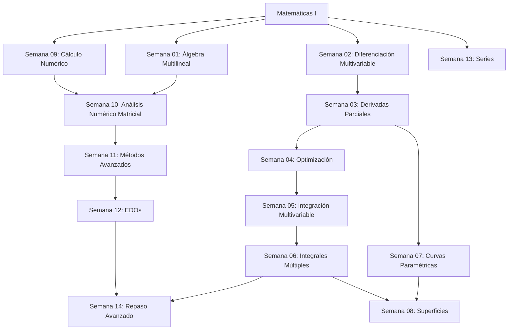

# Matemáticas II - Análisis Avanzado y Álgebra Lineal

## 📚 Descripción del Curso

Este curso profundiza en el análisis matemático multivariable y álgebra lineal avanzada, correspondiente al segundo año del Grado en Matemáticas de la USC. Se enfoca en generalizar los conceptos unidimensionales a espacios multidimensionales y desarrollar herramientas computacionales.

**Duración**: 14 semanas  
**Nivel**: Segundo año universitario  
**Prerrequisitos**: Matemáticas I (Análisis y Álgebra Básica)

---

## 🗓️ Mapa Semanal → Temas → Objetivos

| Semana | Tema | Objetivos Principales | Tiempo Est. |
|--------|------|----------------------|-------------|
| **01** | [Álgebra Lineal y Multilineal](Semana_01_Algebra_Lineal_Multilineal/) | Transformaciones lineales, formas multilineales, tensores básicos | 11h |
| **02** | [Diferenciación en Varias Variables](Semana_02_Diferenciacion_Varias_Variables/) | Límites multivariables, continuidad en ℝⁿ, diferenciabilidad | 12h |
| **03** | [Derivadas Parciales y Gradiente](Semana_03_Derivadas_Parciales_Gradiente/) | Derivadas parciales, gradiente, derivada direccional, regla de la cadena | 11h |
| **04** | [Optimización Multivariable](Semana_04_Optimizacion_Multivariable/) | Extremos locales, multiplicadores de Lagrange, hessiano | 13h |
| **05** | [Integración en Varias Variables](Semana_05_Integracion_Varias_Variables/) | Integrales dobles, cambio de variables, coordenadas polares | 12h |
| **06** | [Integrales Múltiples](Semana_06_Integrales_Multiples/) | Integrales triples, coordenadas cilíndricas y esféricas, aplicaciones | 13h |
| **07** | [Curvas Paramétricas](Semana_07_Curvas_Parametricas/) | Parametrización, longitud de arco, curvatura, torsión | 10h |
| **08** | [Superficies y Geometría](Semana_08_Superficies_Geometria/) | Superficies paramétricas, área de superficie, geometría diferencial básica | 11h |
| **09** | [Cálculo Numérico en una Variable](Semana_09_Calculo_Numerico_Variable/) | Métodos numéricos, aproximación, interpolación, integración numérica | 9h |
| **10** | [Análisis Numérico Matricial](Semana_10_Analisis_Numerico_Matricial/) | Factorización, métodos iterativos, valores propios numéricos | 10h |
| **11** | [Métodos Numéricos Avanzados](Semana_11_Metodos_Numericos_Avanzados/) | EDOs numéricas, métodos de diferencias finitas, estabilidad | 12h |
| **12** | [Ecuaciones Diferenciales](Semana_12_Ecuaciones_Diferenciales/) | EDOs de primer y segundo orden, sistemas lineales, transformada de Laplace | 14h |
| **13** | [Series y Sucesiones](Semana_13_Series_Sucesiones/) | Convergencia, series de potencias, series de Fourier básicas | 11h |
| **14** | [Repaso e Integración Avanzada](Semana_14_Repaso_Integracion_Avanzada/) | Teoremas integrales, aplicaciones multidisciplinares, síntesis | 10h |

**Tiempo total estimado**: **159 horas**

---

## 🎯 Objetivos Generales del Curso

### Conocimientos
- **Análisis multivariable**: Diferenciación e integración en ℝⁿ
- **Álgebra lineal avanzada**: Transformaciones, formas multilineales, espacios normados
- **Métodos numéricos**: Algoritmos computacionales para problemas matemáticos
- **Ecuaciones diferenciales**: Modelado y resolución de sistemas dinámicos

### Habilidades
- **Visualización espacial**: Interpretar conceptos geométricos en dimensiones superiores
- **Computación científica**: Implementar y aplicar métodos numéricos
- **Modelización avanzada**: Formular problemas complejos matemáticamente
- **Análisis crítico**: Evaluar convergencia, estabilidad y precisión de métodos

### Competencias
- **Pensamiento multidimensional**: Generalizar conceptos unidimensionales
- **Integración interdisciplinar**: Conectar matemáticas con física, ingeniería, economía
- **Herramientas computacionales**: Dominar software matemático especializado
- **Investigación**: Desarrollar capacidades para trabajo matemático avanzado

---

## 📋 Estructura de Cada Semana

Cada semana contiene:

### 📖 Teoría (`theory/`)
- Generalizaciones de conceptos unidimensionales
- Teoremas fundamentales del análisis multivariable
- Algoritmos y métodos computacionales
- Aplicaciones a problemas reales

### 💻 Práctica (`practice/`)
- **Ejercicios para resolver**: 3+ problemas con énfasis computacional
- **Ejercicios resueltos**: 2+ problemas con desarrollo completo
- **Hoja de respuestas**: Resultados numéricos y analíticos

### 🎯 Extras (`extras/`)
- Notebooks de Python/MATLAB/Octave
- Visualizaciones 3D y animaciones
- Aplicaciones en ciencias e ingeniería
- Proyectos computacionales

---

## 🔗 Dependencias entre Temas

---

## 📊 Distribución Temática

| Área | Semanas | Porcentaje | Horas |
|------|---------|------------|-------|
| **Análisis Multivariable** | 2-8, 14 | 55% | 87h |
| **Álgebra Lineal Avanzada** | 1 | 7% | 11h |
| **Métodos Numéricos** | 9-11 | 20% | 31h |
| **Ecuaciones Diferenciales** | 12 | 9% | 14h |
| **Series y Análisis** | 13 | 7% | 11h |
| **Síntesis** | 14 | 2% | 5h |

---

## 🔬 Enfoque Computacional

Este curso integra fuertemente las herramientas computacionales:

### Software Recomendado
- **Python**: NumPy, SciPy, Matplotlib, SymPy
- **MATLAB/Octave**: Para cálculo numérico especializado
- **Mathematica/Wolfram**: Para cálculo simbólico avanzado
- **GeoGebra 3D**: Para visualización geométrica

### Proyectos Computacionales
- **Semana 04**: Optimización de funciones reales usando gradiente
- **Semana 06**: Cálculo de volúmenes complejos por integración numérica
- **Semana 10**: Implementación de algoritmos de factorización matricial
- **Semana 12**: Simulación de sistemas dinámicos

---

## 🎓 Evaluación y Seguimiento

### Criterios de Evaluación
- **Comprensión teórica** (35%): Dominio de conceptos multivariables
- **Aplicación práctica** (35%): Resolución de problemas complejos
- **Competencia computacional** (20%): Uso efectivo de herramientas numéricas
- **Síntesis y conexiones** (10%): Integración de conceptos diversos

### Hitos de Aprendizaje

#### Primer Tercio (Semanas 1-5)
- [ ] Dominar diferenciación multivariable
- [ ] Aplicar optimización con restricciones
- [ ] Calcular integrales dobles con cambios de variable

#### Segundo Tercio (Semanas 6-10)
- [ ] Resolver integrales triples en coordenadas generalizadas
- [ ] Parametrizar y analizar curvas y superficies
- [ ] Implementar métodos numéricos básicos

#### Tercer Tercio (Semanas 11-14)
- [ ] Resolver EDOs numéricamente
- [ ] Analizar convergencia de series
- [ ] Integrar conocimientos en problemas complejos

---

## 🌐 Aplicaciones Interdisciplinares

### Física
- **Mecánica**: Trayectorias, campos de fuerzas, energía potencial
- **Electromagnetismo**: Campos vectoriales, flujo, circulación
- **Termodinámica**: Funciones de estado, transformaciones

### Ingeniería
- **Optimización**: Diseño óptimo, control de procesos
- **Análisis estructural**: Tensiones, deformaciones
- **Procesamiento de señales**: Transformadas, filtros

### Economía
- **Optimización económica**: Maximización de utilidad, minimización de costos
- **Modelos dinámicos**: Crecimiento económico, mercados financieros
- **Econometría**: Análisis multivariable de datos

### Ciencias de la Computación
- **Aprendizaje automático**: Optimización de funciones de costo
- **Gráficos por computadora**: Transformaciones geométricas, renderizado
- **Análisis de algoritmos**: Complejidad, convergencia

---

## 📚 Recursos Complementarios

### Bibliografía Especializada
- **Marsden, J.E. & Tromba, A.J.**: "Vector Calculus" - Análisis vectorial completo
- **Strang, G.**: "Linear Algebra and Its Applications" - Álgebra lineal aplicada
- **Burden, R.L. & Faires, J.D.**: "Numerical Analysis" - Métodos numéricos
- **Boyce, W.E. & DiPrima, R.C.**: "Elementary Differential Equations" - EDOs

### Recursos Digitales Avanzados
- **Khan Academy**: Cálculo multivariable visualizado
- **3Blue1Brown**: Series sobre álgebra lineal y cálculo
- **MIT OpenCourseWare**: Cursos completos con videos y ejercicios
- **Coursera/edX**: Cursos especializados en métodos numéricos

### Herramientas de Visualización
- **Plotly**: Gráficos 3D interactivos
- **Mayavi**: Visualización científica avanzada
- **ParaView**: Análisis de datos multidimensionales
- **Blender**: Modelado 3D para conceptos geométricos

---

## ⚠️ Notas Importantes

> **💡 Prerrequisitos Críticos**: Es fundamental dominar completamente Matemáticas I antes de abordar este curso. Los conceptos se construyen directamente sobre esa base.

> **🖥️ Componente Computacional**: A diferencia de Matemáticas I, este curso requiere uso regular de software matemático. Familiarízate temprano con las herramientas.

> **🌍 Visualización Espacial**: Desarrolla tu intuición geométrica en 3D. Usa herramientas de visualización regularmente.

> **🔄 Integración Continua**: Los temas están fuertemente interconectados. Mantén una perspectiva global del curso.

> **📊 Aplicaciones Prácticas**: Cada concepto tiene aplicaciones reales. Busca conexiones con tu área de interés.

---

## 🚀 Preparación para Cursos Avanzados

Este curso prepara para:
- **Análisis Real Avanzado**: Teoría de la medida, espacios de funciones
- **Análisis Funcional**: Espacios normados, operadores lineales
- **Geometría Diferencial**: Variedades, formas diferenciales
- **Ecuaciones en Derivadas Parciales**: Modelado de fenómenos continuos
- **Análisis Numérico Avanzado**: Métodos de elementos finitos, diferencias finitas

---

**Fecha de creación**: 2024-11-28  
**Última actualización**: 2024-11-28  
**Versión**: 1.0